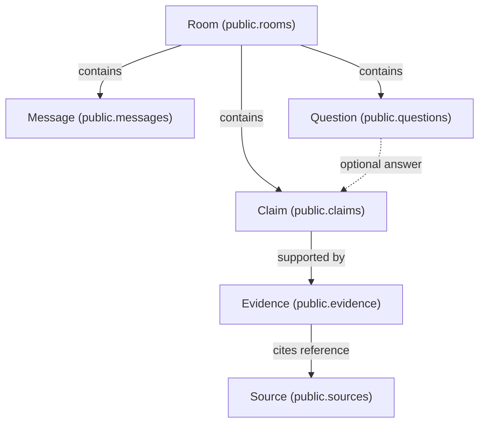
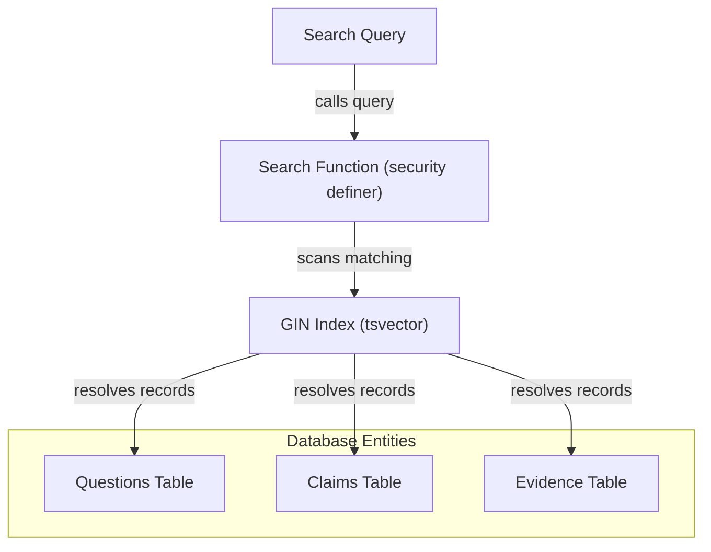
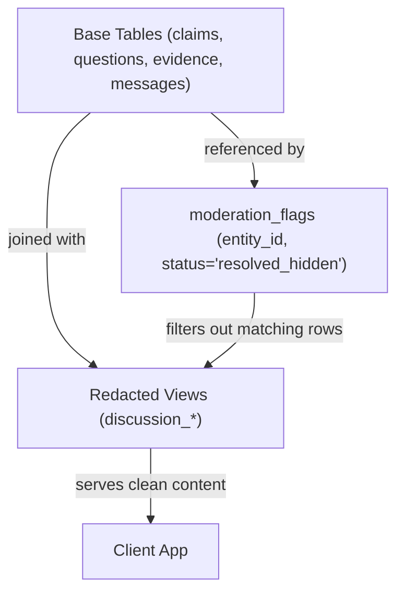
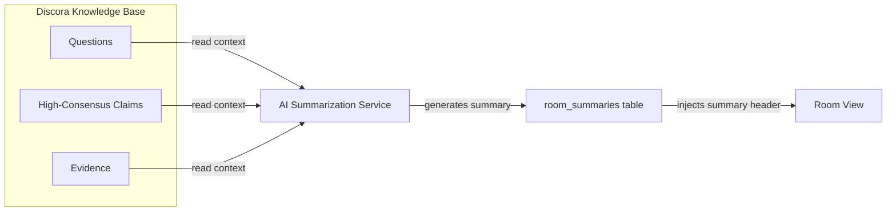
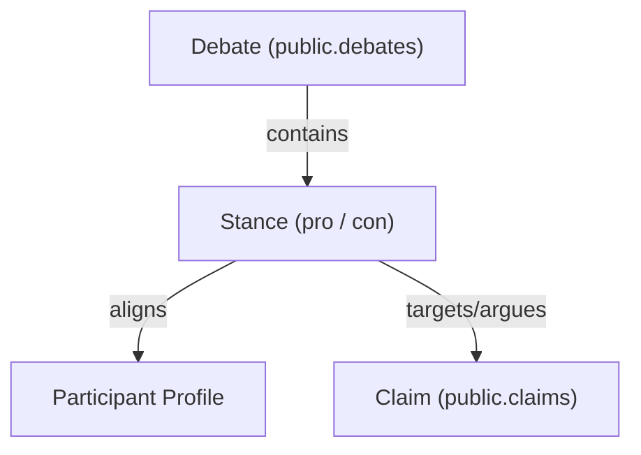

# Discora — Knowledge Graph Evolution

## 1. Current State Knowledge Graph

Currently, Discora models room knowledge as a hierarchical containment tree where claims, evidence, and questions are room-scoped, and claims are optionally mapped as answers to questions.

---

## 2. Search Indexing Integration

To enable search, text search indexing (GIN indexes) will run on the primary entities without modifying the graph relationships.

---

## 3. Moderation Integration

Moderation operates as an overlay layer. The `moderation_flags` table references the entity IDs, filtering them out of client-facing views.

---

## 4. AI Summaries & Synthesis Integration

AI Summaries would read from room questions and high-consensus claims to write summaries back to a dedicated table.

---

## 5. Debate Integration

Future debate spaces can wrap room-scoped claims and evidence into pro/con stances, separating participants by team.

