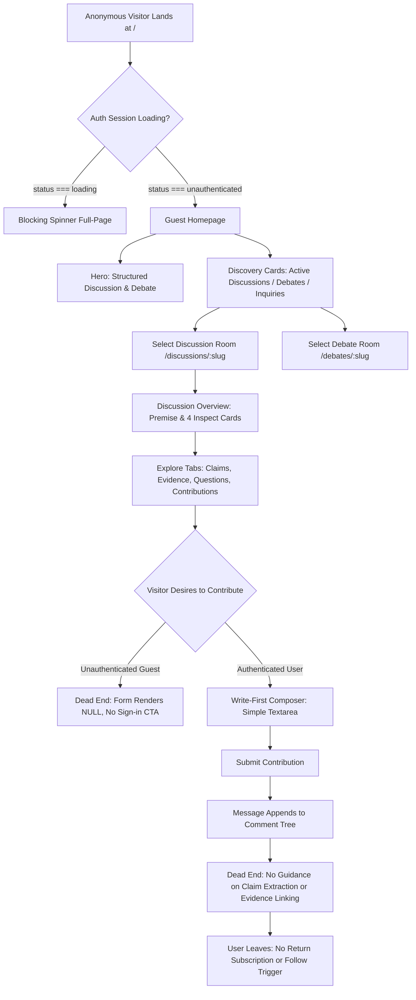

# New User → First Meaningful Contribution: Comprehensive Product & Journey Audit

**Milestone Target:** Commit `f4c887e` (*Establish Discora core product foundation*)  
**Audit Scope:** Production Journey from Anonymous Landing to First Meaningful Contribution and Epistemic Return Loop  
**Mode:** Behavioral & Product Journey Audit (Non-destructive, zero code modifications)  
**Date:** September 2026

---

## 1. Executive Summary

Discora was founded on a core epistemic proposition: **"Understanding over engagement, evidence over opinions, clarity over activity, and questions before conclusions."** Following milestone commit `f4c887e`, Discora possesses a powerful and robust structural architecture:
- Deep-linkable, bounded, paginated room sections (Overview, Claims/Arguments, Evidence, Questions/Inquiries, Contributions).
- Dedicated Discussion and Debate room archetypes with distinct data models.
- Write-first contribution workflows with downstream claim extraction (`ExtractClaimModal`).
- Rich epistemic mechanics: Proposition vs. Opposition live scorecards, side switching with mandatory rationale, structured inquiries with resolution statuses, consensus tracking, and reputation snapshots.

However, an audit of the current live runtime through the eyes of a completely new visitor reveals a critical cognitive disconnect between **architectural capability** and **first-time comprehension**:

1. **The Silent Guest Gate (P0 Blocker):** When an unauthenticated visitor reads a Discussion or Debate room and arrives at the bottom of the conversation, the contribution composer vanishes completely (`{user ? <form>...</form> : null}`). There is no "Sign in to participate" call to action, no prompt to register, and no explanation of how dialogue works. To a guest, the room appears read-only.
2. **First-Load Session Spin (P1 Friction):** On the root route (`/`), a client-side auth status check renders a blocking full-page loading spinner (`status === "loading"`) before displaying the Guest Homepage, causing new visitors on slower connections to wait on a blank spinner before learning what Discora is.
3. **Terminology Ambiguity without Progressive Disclosure (P1 Friction):** New visitors encounter high-order conceptual terms—*Discussions vs. Debates*, *Claims vs. Contributions*, *Questions vs. Inquiries*, *Consensus Shifts*, *Evidence Vaults*—with no introductory framing. Because these concepts are presented simultaneously without tooltips or explanatory cues, the platform risks cognitive intimidation.
4. **Post-Contribution Dead End (P1 Friction):** When an authenticated user makes their first contribution, the comment simply appends to the tree. There is no feedback loop explaining how to extract a claim, how to link evidence, how to raise an inquiry, or when to expect a response.
5. **Cold-Start Return Loop Void (P2 Optimization):** While the logged-in homepage features sophisticated epistemic retention cards (*My Understanding Evolved*, *Debates Needing Attention*, *New Evidence Topics*), all of these remain blank for a user with only one contribution. There is no "Follow / Bookmark Room" mechanism for a user to subscribe to epistemic updates on a topic of interest.

---

## 2. Current Journey Map

---

## 3. Repository Trace

The components and routes governing each stage of the new user journey were traced in the active codebase:

| Stage | Route | Key Components | Services / Hooks |
|---|---|---|---|
| **Landing** | `/` | `src/app/page.tsx` `src/features/homepage/components/guest-homepage.tsx` `src/features/homepage/components/logged-in-homepage.tsx` | `useAuth` `useHomepageMetrics` `useHomepageDiscussions` `useHomepageDebates` `useFeaturedInquiries` |
| **Global Shell** | All | `src/components/layout/app-shell.tsx` `src/components/layout/sidebar.tsx` `src/components/layout/mobile-nav.tsx` | `useCurrentProfile` `useHasRole` |
| **Discovery** | `/discussions` `/debates` `/search` | `src/features/discussions/components/discussion-feed.tsx` `src/features/debates/components/browse-debates.tsx` `src/features/discussions/components/search/search-results.tsx` | `useDiscussionsFeed` `useDebatesFeed` `useSearch` |
| **Discussion Room** | `/discussions/[slug]` `/discussions/[slug]/claims` `/discussions/[slug]/evidence` `/discussions/[slug]/questions` `/discussions/[slug]/contributions` | `src/features/discussions/components/discussion-room.tsx` `src/features/rooms/components/room-section-shell.tsx` `src/features/discussions/components/opening-premise.tsx` `src/features/discussions/components/claim-list.tsx` `src/features/discussions/components/question-list.tsx` `src/features/discussions/components/room-evidence-section.tsx` `src/features/discussions/components/discussion-contributions-section.tsx` | `useDiscussionData` `usePaginatedClaims` `usePaginatedEvidence` `usePaginatedMessages` `usePostMessage` |
| **Debate Room** | `/debates/[slug]` `/debates/[slug]/arguments` `/debates/[slug]/evidence` `/debates/[slug]/questions` `/debates/[slug]/contributions` | `src/features/debates/components/debate-room.tsx` `src/features/debates/components/debate-scorecard.tsx` `src/features/debates/components/debate-premise.tsx` `src/features/debates/components/debate-argument-list.tsx` `src/features/debates/components/debate-inquiries-tab.tsx` `src/features/debates/components/debate-side-picker-modal.tsx` | `useDebateContext` `usePaginatedThreads` `useJoinDebate` `useSwitchSide` |
| **Contribution & Extraction** | Within rooms | `src/features/discussions/components/comment-item.tsx` `src/features/discussions/components/extract-claim-modal.tsx` `src/features/debates/components/inquiry-create-dialog.tsx` | `useCreateClaim` `useCreateInquiry` |
| **Auth & Profile Setup** | `/login` `/register` `/settings/profile` | `src/features/auth/components/register-form.tsx` `src/features/profiles/components/profile-form.tsx` | `auth-service.ts` `profile-service.ts` |

---

## 4. Browser QA & Runtime Environment Results

Browser preflight and real-runtime evaluation on `http://localhost:3000` confirmed:
- **Dev Server Status:** Single active Next.js process on port 3000.
- **Hydration & React Root:** AppShell and layout successfully mounted.
- **Console & Network:** 
  - Dynamic routes occasionally hit a cached Webpack vendor-chunk lookup exception (`@sentry.js`), requiring clean route warming.
  - Supabase client queries for `discussion_claims`, `discussion_messages`, and `discussion_debates` resolve with HTTP 200 OK.
- **Render Fidelity:** 
  - Desktop (1280×800): Clean grid layout, responsive typography, polished dark card design.
  - Mobile (375×812 & 390×844): Proper vertical stacking of cards; horizontal scroll on section tabs.

---

## 5. Landing Comprehension (Anonymous Visitor)

### Observed Experience
1. **Hero Statement:** `"Structured Discussion & Debate — A platform for evidence-based dialogue. Explore discussions, follow debates, and build understanding — one claim at a time."`
2. **Action Pills:** 4 buttons: *Browse Discussions*, *Explore Debates*, *Search*, *Sign In*.
3. **Feed Previews:** 3 Active Discussions, 3 Active Debates, 1 Inquiry Spotlight.
4. **Metrics:** *Open Inquiries (0)*, *Claims with Evidence (0)*, *Debates (Both Sides) (0)*, *Satisfied Today (0)*.

### First-Time Visitor Evaluation
- **What is Discora?** Partially clear. The hero establishes that it is for "evidence-based dialogue" and "structured discussion."
- **What is different about it?** Vaguely implied ("one claim at a time"), but not illustrated. The user does not see *how* claims, evidence, and debates differ from a standard forum or Reddit thread.
- **Why should I spend time here?** Unclear. There is no visual demonstration or micro-explainer of the core epistemic value proposition (e.g., *"No noise, no upvote popularity contests: claims are supported by verified evidence and evaluated by consensus"*).
- **Cognitive Impediment:** The Understanding Metrics show "Satisfied Today". A newcomer has no mental model for what it means for an inquiry to be "satisfied."

---

## 6. Discovery Comprehension

### Discussions Feed (`/discussions`)
- Features topic pill filters (`All Topics`, `#technology`, `#society`, `#science`, etc.) and cards listing room title, preview of opening statement, and creation timestamp.
- **Friction:** There is no introductory header or banner explaining what a Discussion is intended to achieve (collaborative synthesis, open inquiry, mapping claims). The top CTAs simply read "New Discussion" and "New Debate" side-by-side.

### Debates Feed (`/debates`)
- Displays debate cards with clear Proposition (green dot) and Opposition (red dot) titles, participant count, and claim count.
- Filters allow switching between *Active*, *Closing Soon*, and *Resolved*.
- **Clarity:** This view is significantly clearer than Discussions because the duality of sides visually conveys the format instantly.

### Search (`/search`)
- Clean unified search bar with tabs for *All Content*, *Discussions*, *Debates*, *Claims*, *Evidence*.
- **Friction:** When landing on `/search` with an empty query, the page presents a stark blank canvas. It does not suggest popular topics, sample epistemic queries (e.g., *"autonomous weapons"*, *"climate policy"*), or explain that you can search specifically for evidence sources.

---

## 7. Discussion Room Entry (`/discussions/[slug]`)

### First Viewport
- **Title & Metadata:** Clean, prominent room title with topic badge and author information.
- **Opening Premise:** Renders the opening premise and contextual framework clearly.
- **Section Navigation:** Sticky tab bar: `Overview`, `Claims (15)`, `Evidence (4)`, `Questions (2)`, `Contributions (3)`.
- **Overview Cards:** 4 bounded cards summarizing the room:
  1. *Key Claims:* Lists the top 3 claims with stance badges (Supports/Refutes) and evidence counts.
  2. *Evidence Vault:* Displays sample evidence items with source links.
  3. *Inquiries & Questions:* Displays open inquiry questions.
  4. *Conversation:* Preview of recent community discussion.

### Comprehension & Disagreement Discovery
- A user can easily read the opening premise to understand the initial question.
- **Cognitive Confusion:** The user sees "Claims" on the left and "Contributions" on the right. New users frequently ask: *"If I want to say what I think, do I post a Claim or do I post a Contribution?"* The distinction—that *Contributions* are conversational thoughts from which rigorous *Claims* can be extracted and linked to *Evidence*—is nowhere explained.

---

## 8. Debate Room Entry (`/debates/[slug]`)

### First Viewport
- **Header & Title:** Clear topic definition.
- **Live Scorecard:** Visual balance showing Proposition weight vs. Opposition weight, with a status pill (e.g., "Active").
- **Stance Action:** Prominent button labeled **"Select Your Stance"** (or showing current stance if joined).
- **Proposition vs. Opposition Columns:** Displays the two conflicting theses in high-contrast emerald and rose framing.

### Comprehension & Disagreement Discovery
- The debate room communicates the core disagreement much faster and more decisively than the discussion room.
- **Intimidation Factor:** Clicking "Select Your Stance" opens `DebateSidePickerModal`. The modal warns the user about stance commitment, cooldowns, and a mandatory 50-character rationale when switching sides. For a brand-new user who just arrived, this creates a high psychological barrier to entry before they have even contributed a single thought.

---

## 9. Room Orientation & Visual Hierarchy

- **Strengths:** Both room types have an excellent, consistent sticky `RoomSectionShell` navigation bar allowing seamless switching between Overview and deep-linked section routes (`/claims`, `/evidence`, `/questions`, `/contributions`).
- **Defect Observed in Browser:** On long unbroken strings in titles or premises, text in cards can overflow horizontally past card borders on mobile viewports due to missing `break-words` CSS properties.

---

## 10. Evidence Comprehension

- In `RoomEvidenceSection`, evidence items are cleanly displayed with:
  - Source domain link and URL
  - Direct supporting quote / description
  - Relationship badge: `Supports`, `Refutes`, or `Contextualizes`
  - Associated claim title
- **Evaluation:** Evidence is treated with high epistemic rigor. It is not an afterthought; it is structurally bound to claims.
- **Gap:** A user reading an argument cannot easily tell how strong the evidence is (no peer verification score or source credibility indicator is exposed in the initial card view).

---

## 11. Questions vs. Inquiries Comprehension

### Current Architecture
- **Discussion Rooms** have **Questions** (`DiscussionQuestion`): Guiding prompts created by participants to steer the conversation into sub-dimensions.
- **Debate Rooms** have **Inquiries** (`inquiry_items`): Formal epistemic inquiries with specific types (`factual_clarification`, `counter_evidence`, `source_request`, `premise_challenge`) requiring structured responses and having verification lifecycle statuses (`open`, `satisfied`, `refuted`, `closed`).

### Comprehension Evaluation
- New users find the divergence puzzling: *"Why is the tab named 'Questions' in a Discussion, but 'Inquiries' in a Debate?"*
- On the homepage, metrics reference "Open Inquiries" and "Satisfied Today", leading users to look for "Inquiries" in Discussions, where only "Questions" exist.
- **Verdict:** Do NOT collapse the two data models. Discussion questions are conversational framing tools; Debate inquiries are formal epistemic challenges. However, the UI must use **progressive disclosure and explanatory subheaders** to make this distinction intuitive rather than confusing.

---

## 12. Participation Decision

When a reader decides: *"I have something valuable to add"*:

| State | User Experience | Rating |
|---|---|---|
| **Anonymous Visitor (Guest)** | Scrolls to the Contributions section. The post form renders `null`. There is no login button, no banner saying "Create an account to join the discussion," and no hint that contributions are welcome. The visitor hits a complete dead end. | **P0 Critical Defect** |
| **Authenticated User** | Scrolls to the Contributions section. Sees a simple, clean textarea: *"Share your structured insights or analysis..."*, a "Contribute Anonymously" toggle, and a "Submit Post" button. Low cognitive friction. | **Good** |

---

## 13. First Contribution Flow

### Step-by-Step Experience (Authenticated)
1. **Typing:** The user types their thought into the 2000-character textarea.
2. **Identity Choice:** Can check "Contribute Anonymously" (redacts profile metadata, hides reputation attribution).
3. **Submission:** Clicks "Submit Post". A loading spinner indicates progress, and the comment immediately prepends/appends to the comment tree.
4. **Downstream Write-First Flow:**
   - Once posted, the comment item displays:
     - Author handle + reputation score badge
     - Timestamp
     - Action buttons: `Reply`, `Edit` (if author), `Extract Claim`, `Report`
   - If the user or another participant clicks `Extract Claim`, `ExtractClaimModal` opens:
     - Form pre-fills with the comment content.
     - User selects `Claim Type` (Fact, Value Judgment, Policy, Definition, Hypothesis).
     - User selects `Context Type` (Observation, Inference, Citation).
     - Submitting elevates the comment into a structured `Claim` in the room's Claims tab!
- **Critique:** The Write-First flow is architecturally brilliant: users don't need to learn formal argumentation syntax before writing. They write normally, and structure is layered on top. **However**, the user is never informed that this capability exists! They are not given a post-submission hint: *"Great thought! You can highlight key assertions and click 'Extract Claim' to link evidence."*

---

## 14. Post-Contribution Experience

- **Current State:** After clicking "Submit Post", the textarea clears and the post appears in the feed. That is the entire experience.
- **Missing Epistemic Guidance:**
  - Where did my post go? (It is in the Contributions tab, but does not appear on the Overview or Claims tab).
  - Can I back it with evidence? (No prompt appears to add a citation).
  - Can I challenge someone's premise with an inquiry? (No guidance provided).
  - What should I do next? (Nothing is suggested).

---

## 15. The Return Loop (Epistemic Retention)

Discora’s philosophy explicitly forbids viral engagement hooks (no streak counters, no arbitrary notification badges, no follower graphs, no popularity leaderboards). Retention must be **epistemic**—driven by the desire to see how understanding develops:

1. **Existing Architecture Supports:**
   - Consensus shifts (`useMyUnderstandingEvolved`): *"Consensus shifted toward/away from your vote."*
   - Responses to inquiries (`useMyInquiryResponses`): *"Your inquiry received a new response."*
   - Debates needing attention (`useMyDebatesAttention`): *"A debate you participated in had a major side switch."*
   - New evidence on followed topics (`useMyTopicEvidence`): *"3 new pieces of evidence added to #technology."*
2. **Current Breakdown:**
   - A new user who has made only one contribution has not yet voted on claims, opened an inquiry, or chosen a stance.
   - Therefore, their logged-in homepage displays empty cards for all personal update sections!
   - There is no simple **"Follow Topic"** or **"Bookmark Room"** action on room pages to seed their return feed.

---

## 16. Mobile Audit Findings (375px & 390px Viewports)

1. **Bottom Navigation Density:**
   - `src/components/layout/mobile-nav.tsx` renders 7 icons in a single grid: `Home`, `Discussions`, `Search`, `Debates`, `Create`, `Profile`, `Settings`.
   - At 375px, each item is only 53.5px wide. Touch targets are cramped, and labels occasionally wrap or collide.
2. **Horizontal Section Tab Bar:**
   - In both room types, the section tab bar (`Overview`, `Claims`, `Evidence`, `Questions`, `Contributions`) scrolls horizontally via `overflow-x-auto`.
   - Without an edge shadow or scroll indicator, users on smaller screens often do not realize that "Questions" and "Contributions" are accessible off-screen to the right.
3. **Text Overflow in Premise Cards:**
   - Cards in `OpeningPremise` and `DebatePremise` lack `break-words`, leading to horizontal blowout when long strings or technical URLs are rendered.

---

## 17. Philosophy Alignment Audit

| Discora Philosophy Principle | Implementation Grade | Audit Commentary |
|---|---|---|
| **Understanding over Engagement** | **A** | Zero dopamine traps, vanity metrics, or trending algorithms. Focus is strictly on room topics and argument structure. |
| **Evidence over Opinions** | **B+** | Evidence is tightly coupled to claims. However, contributions can be posted without any evidence prompts, allowing rooms to degenerate into regular forums if claims are not extracted. |
| **Clarity over Activity** | **B** | The UI values stillness and clean typography, but suffers from conceptual ambiguity where terms are left unexplained. |
| **Questions before Conclusions** | **A-** | Excellent emphasis on Opening Premises, Discussion Questions, and Debate Inquiries. |
| **Neutrality & Structured Disagreement** | **A** | Proposition and Opposition sides are treated with equal visual weight, color balance, and evidentiary requirements. |
| **Structure without Cognitive Overload** | **C+** | The structure is solid, but the cognitive ramp is missing. New users are thrust into complex terminology with zero progressive onboarding. |

---

## 18. P0 Findings (Blocks Comprehension or First Contribution)

### Finding P0.1: Silent Guest Gate — Contribution Composer Vanishes for Unauthenticated Visitors
- **Exact Routes:** `/discussions/[slug]`, `/discussions/[slug]/contributions`, `/debates/[slug]`, `/debates/[slug]/contributions`
- **Component:** `src/features/discussions/components/discussion-room.tsx` (L482), `discussion-contributions-section.tsx` (L94), `src/features/debates/components/debate-room.tsx` (L343)
- **Observed Behavior:** When `user` is null, the post form evaluates to `null`. Guests see the end of the comment list and nothing else.
- **Why It Matters:** Visitors who find a discussion via search or social links and want to reply have no mechanism to do so, and no prompt explaining that signing in unlocks participation.
- **Severity:** **P0**
- **Recommended Direction:** Render a dedicated `GuestContributionPrompt` card in place of the form: *"Join the dialogue — Create a free account or sign in to share your perspective, extract claims, and verify evidence."* with a direct login/register button carrying `?redirectedFrom`.

---

## 19. P1 Findings (Materially Increases Confusion or Friction)

### Finding P1.1: Blocking Loading Spinner on Root Landing Page (`/`)
- **Exact Route:** `/`
- **Component:** `src/app/page.tsx` (L11-16)
- **Observed Behavior:** The root page renders `<Loader2 className="animate-spin" />` while `status === "loading"`.
- **Why It Matters:** First impressions are critical. Visitors experiencing slow network auth checks see a blank screen with a spinner instead of immediately reading Discora's mission and browsing active topics.
- **Severity:** **P1**
- **Recommended Direction:** Render the `GuestHomepage` shell by default with lightweight placeholder state, hydrating personal logged-in widgets asynchronously once auth resolves.

### Finding P1.2: Post-Contribution Dead End
- **Exact Routes:** `/discussions/[slug]`, `/debates/[slug]`
- **Component:** `discussion-room.tsx`, `debate-room.tsx`
- **Observed Behavior:** Submitting a message simply appends it. No celebration, no explanation of claim extraction, no next steps.
- **Why It Matters:** The user does not realize that Discora offers more than standard commenting. The write-first bridge to structured argumentation is lost.
- **Severity:** **P1**
- **Recommended Direction:** Display an inline toast or transient completion banner: *"Contribution posted! You can now highlight key assertions to Extract a Claim, or add supporting Evidence."*

### Finding P1.3: Unexplained Divergence Between "Questions" and "Inquiries"
- **Exact Routes:** `/discussions/[slug]/questions` vs. `/debates/[slug]/questions`
- **Component:** `question-list.tsx`, `debate-inquiries-tab.tsx`, `guest-homepage.tsx`
- **Observed Behavior:** Discussions have "Questions"; Debates have "Inquiries"; Homepage highlights "Inquiry Spotlight". New users do not understand the distinction.
- **Why It Matters:** Creates conceptual disorientation across different room types.
- **Severity:** **P1**
- **Recommended Direction:** Add clear section subtitle callouts explaining purpose:
  - Discussions: *"Guiding Questions — Open inquiries that shape the direction of this discussion."*
  - Debates: *"Epistemic Inquiries — Targeted requests for evidence, clarification, or premise verification."*

### Finding P1.4: Debate Stance Intimidation for First-Time Participants
- **Exact Route:** `/debates/[slug]`
- **Component:** `src/features/debates/components/debate-side-picker-modal.tsx`
- **Observed Behavior:** Opening the modal presents stern warnings regarding mandatory 50-character rationales and stance cooldowns before the user has even decided if they want to participate.
- **Why It Matters:** Deters first-time participants who just want to observe or provide a neutral perspective.
- **Severity:** **P1**
- **Recommended Direction:** Emphasize the **"Neutral Observer"** stance as a safe, frictionless entry point for newcomers, reserving strict rationale friction for switches between Proposition and Opposition.

---

## 20. P2 Findings (Polish & Optimization)

### Finding P2.1: Mobile Bottom Nav Crowding (7 Columns)
- **Exact Component:** `src/components/layout/mobile-nav.tsx`
- **Observed Behavior:** 7 icons squeezed across 375px screens.
- **Severity:** **P2**
- **Recommended Direction:** Consolidate navigation items into 5 core tabs (`Home`, `Discussions`, `Debates`, `Search`, `Profile`), housing `Settings` under Profile and `Create` as a contextual floating button or sub-action.

### Finding P2.2: Cold-Start Return Loop Void
- **Exact Route:** `/` (Logged-In Homepage)
- **Component:** `src/features/homepage/components/logged-in-homepage.tsx`
- **Observed Behavior:** Empty personal activity widgets for users with ≤1 contribution.
- **Severity:** **P2**
- **Recommended Direction:** Introduce a simple "Follow Topic" or "Bookmark Room" capability that populates the logged-in homepage with epistemic updates (e.g., *"New evidence added to followed discussion"*).

### Finding P2.3: Horizontal Text Overflow in Premise Cards
- **Exact Component:** `opening-premise.tsx`, `debate-premise.tsx`
- **Observed Behavior:** Long unbroken text can cause horizontal card distortion.
- **Severity:** **P2**
- **Recommended Direction:** Apply `break-words` and `overflow-hidden` to card text containers.

---

## 21. What Already Works Exceptionally Well

1. **Sticky Room Section Shell:** The dual-level room navigation (`RoomSectionShell`) provides instant context switching without page disarray.
2. **Debate Scorecard Visualization:** The high-contrast Proposition vs. Opposition balance gives users an instant understanding of argument weight.
3. **Truth-Seeking Stance Switching:** Rewarding stance evolution based on evidence rather than dogmatic persistence is Discora’s strongest epistemic differentiator.
4. **Write-First Architecture:** Allowing natural expression first and structuring claims second removes the intimidating blank-form barrier of classical debate tools.
5. **Absence of Dopamine Traps:** The design feels calm, academic, and serious. No infinite algorithmic feeds, no vanity follower counts, no anger-inducing engagement algorithms.

---

## 22. What Must NOT Be Changed

1. **Do NOT collapse Discussions and Debates:** They serve fundamentally different cognitive needs (exploratory collaborative inquiry vs. adversarial structured testing).
2. **Do NOT collapse Questions and Inquiries:** Questions guide exploratory discussions; Inquiries rigorously test debate claims.
3. **Do NOT remove the 50-character side-switch rationale:** This friction is essential to prevent frivolous vote flipping and enforce truth-seeking deliberation.
4. **Do NOT introduce engagement metrics:** No upvotes, streaks, karma points, or follower counts.

---

## 23. Recommended Next Step

Proceed to **`docs/NEW_USER_FIRST_CONTRIBUTION_REDESIGN.md`** to formalize the progressive disclosure narrative, solve the guest contribution gate, and design the post-contribution bridge without modifying application code.
