# New User → First Meaningful Contribution: Phased Implementation Plan

**Milestone Context:** Follow-up to Commit `f4c887e` (*Establish Discora core product foundation*)  
**Scope:** Engineering Roadmap to execute the New User First Contribution Redesign  
**Status:** PLAN ONLY — NO SOURCE CODE MODIFICATIONS PERMITTED  
**Date:** September 2026

---

## 1. Overview & Strategy

This implementation plan defines the step-by-step technical roadmap to execute the recommendations from `docs/NEW_USER_FIRST_CONTRIBUTION_REDESIGN.md`.

The implementation is structured into **Four Controlled Phases**, sequenced strictly to resolve blockers first (P0), eliminate primary cognitive friction second (P1), and deliver polish/retention optimizations third (P2):

```text
Phase 1: Critical Participation Gate (P0)
  └── Unlock guest contribution visibility across all room routes.

Phase 2: First-Impression & Discovery Clarity (P1)
  └── Remove root page loading hang, clarify archetype headers, populate search empty state.

Phase 3: Write-First Escalation & Epistemic Ramp (P1)
  └── Add post-contribution feedback banner, claim extraction tooltips, and explanatory subheaders.

Phase 4: Mobile Ergonomics & Epistemic Return Loop (P2)
  └── Streamline 7-column bottom nav to 5 tabs, add horizontal scroll cues, fix premise text wrapping, and seed followed room cards.
```

---

## 2. Phase Breakdown & Component Matrix

### Phase 1: Critical Participation Gate (P0 Blocker Resolution)
**Objective:** Ensure that every visitor, authenticated or guest, sees an immediate and clear path to participate in discussions and debates.

| Component / File | Modification Nature | Description |
|---|---|---|
| `src/features/discussions/components/discussion-room.tsx` (L482) | Component update | Replace `{user ? <form>...</form> : null}` with a conditional branch rendering `<GuestContributionPrompt>` when `user` is null. |
| `src/features/discussions/components/discussion-contributions-section.tsx` (L94) | Component update | Add `<GuestContributionPrompt>` fallback below the comment tree for unauthenticated visitors on `/contributions` deep link. |
| `src/features/debates/components/debate-room.tsx` (L343) | Component update | Add `<GuestContributionPrompt>` fallback in debate room contribution tabs. |
| `src/features/rooms/components/guest-contribution-prompt.tsx` | **[NEW COMPONENT]** | Shared presentation component with "Create Account" and "Sign In" buttons including `?redirectedFrom` URL parameters. |

**Dependencies:** Existing Next.js `usePathname()` and `useAuth()`. Zero database or backend dependencies.  
**Regression Risks:** None. Does not alter authenticated user submission logic.

---

### Phase 2: First-Impression & Discovery Clarity (P1 Friction Resolution)
**Objective:** Eliminate the initial blank spinner on the homepage and provide immediate conceptual clarity on discovery feeds.

| Component / File | Modification Nature | Description |
|---|---|---|
| `src/app/page.tsx` (L11-16) | Optimization | Replace the blocking full-page `<Loader2 className="animate-spin" />` with an immediate render of the `GuestHomepage` shell with skeleton states for dynamic metrics, hydrating personal user data asynchronously once auth resolves. |
| `src/features/homepage/components/guest-homepage.tsx` | UI Enhancement | Add the 3-step visual epistemic banner (*1. Read Premise → 2. Examine Evidence → 3. Track Consensus*) and rephrase "Satisfied Today" to "Inquiries Answered". |
| `src/features/discussions/components/discussion-feed.tsx` | Copy & Header | Add an informative archetype subtitle: *"Exploratory Inquiry · Multi-Perspective Synthesis"*. |
| `src/features/debates/components/browse-debates.tsx` | Copy & Header | Add an informative archetype subtitle: *"Structured Clash · Proposition vs. Opposition"*. |
| `src/features/discussions/components/search/search-results.tsx` | Empty-State UI | When search query is empty, display helpful starter prompt cards for topics and evidence rather than a stark blank canvas. |

**Dependencies:** Existing feed queries. Zero schema dependencies.  
**Regression Risks:** Ensure Next.js SSR / hydration match between server and client on the homepage.

---

### Phase 3: Write-First Escalation & Epistemic Ramp (P1 Friction Resolution)
**Objective:** Guide users seamlessly from raw conversational contributions to structured claims and evidence.

| Component / File | Modification Nature | Description |
|---|---|---|
| `src/features/discussions/components/discussion-room.tsx`<br>`src/features/debates/components/debate-room.tsx` | State & Toast | After successful `postMutation`, show a transient guidance toast or banner: *"Contribution posted! Highlight key assertions to Extract a Claim or link Evidence."* |
| `src/features/discussions/components/extract-claim-modal.tsx` | Tooltip Guidance | Add helper tooltips explaining the definitions of Fact, Value Judgment, and Policy claims. |
| `src/features/discussions/components/question-list.tsx` | Subheader Clarification | Add subheader: *"Guiding Questions — Open inquiries that shape the direction of this discussion."* |
| `src/features/debates/components/debate-inquiries-tab.tsx` | Subheader Clarification | Add subheader: *"Epistemic Inquiries — Targeted requests for evidence, factual clarification, or premise verification."* |
| `src/features/debates/components/debate-side-picker-modal.tsx` | Micro-copy & Stance UI | Highlight the "Neutral Observer" option prominently for first-time visitors as a frictionless entry point, preserving the 50-character rationale requirement for active side switches. |

**Dependencies:** Existing `useCreateClaim`, `usePostMessage`, and `toast`.  
**Regression Risks:** Modal closing behavior and form validation schemas must remain strictly intact.

---

### Phase 4: Mobile Ergonomics & Epistemic Return Loop (P2 Optimization)
**Objective:** Deliver polished mobile interaction and seed the personalized return loop for new contributors.

| Component / File | Modification Nature | Description |
|---|---|---|
| `src/components/layout/mobile-nav.tsx` | Layout Refactor | Consolidate the 7-column bottom nav into 5 ergonomic items (`Home`, `Discussions`, `Debates`, `Search`, `Profile`). Move Settings under Profile; place Create as a contextual top or floating action. |
| `src/features/rooms/components/room-section-shell.tsx` | CSS Polish | Add right-fade gradient cue on the horizontal tab bar so mobile users recognize additional sections off-screen. |
| `src/features/discussions/components/opening-premise.tsx`<br>`src/features/debates/components/debate-premise.tsx` | Defensive CSS | Add `break-words` and `overflow-hidden` to avoid horizontal text blowouts on small screens. |
| `src/features/rooms/components/room-section-shell.tsx` | Feature Component | Add a "Follow Topic / Bookmark Room" button in the room header to seed the user's return feed. |
| `src/features/homepage/components/logged-in-homepage.tsx` | Feed Integration | Display "Followed Rooms" in the personal activity feed to close the return loop. |

**Dependencies:** Profile settings route, existing topic/room subscriptions if present or local bookmark state.  
**Regression Risks:** Ensure mobile navigation active states (`pathname`) continue to highlight the correct tabs.

---

## 3. Implementation Order & Critical Path

```mermaid
gantt
    title New User First Contribution Implementation Path
    dateFormat  X
    axisFormat %s
    
    section Phase 1 (P0)
    Guest Contribution Prompt Component        :active, p1_1, 0, 1
    Integrate Guest Prompt in Discussion Room  :p1_2, after p1_1, 1
    Integrate Guest Prompt in Debate Room      :p1_3, after p1_1, 1
    
    section Phase 2 (P1)
    Non-blocking Homepage Auth Hydration       :p2_1, after p1_3, 2
    Discovery Feeds Archetype Headers          :p2_2, after p2_1, 1
    Search Empty-State Prompt Cards            :p2_3, after p2_2, 1
    
    section Phase 3 (P1)
    Post-Contribution Guidance Banner/Toast     :p3_1, after p2_3, 2
    Extract Claim Modal Helper Tooltips        :p3_2, after p3_1, 1
    Questions vs Inquiries Subheaders          :p3_3, after p3_2, 1
    Debate Neutral Stance Onboarding Highlight :p3_4, after p3_3, 1
    
    section Phase 4 (P2)
    Mobile Nav Consolidation (5 Tabs)          :p4_1, after p3_4, 2
    Horizontal Section Tab Scroll Gradient     :p4_2, after p4_1, 1
    Card Text-Wrap Overflow Protection         :p4_3, after p4_2, 1
    Follow Room / Epistemic Return Bookmark    :p4_4, after p4_3, 2
```



---

## 4. Browser QA & Verification Matrix

Every phase must pass real browser verification under both Authenticated and Guest states before acceptance:

| Test ID | Test Description | Viewport | Target Route | Expected Outcome |
|---|---|---|---|---|
| **QA-P1-01** | Guest Contribution CTA in Discussion | Desktop (1280×800) | `/discussions/[slug]` | Scrolling to Contributions displays `<GuestContributionPrompt>` with functional Sign In / Register buttons. |
| **QA-P1-02** | Guest Contribution CTA in Debate | Desktop (1280×800) | `/debates/[slug]` | Contributions section displays guest prompt with correct `redirectedFrom` URL parameters. |
| **QA-P2-01** | Root Page Instant Render | Desktop (1280×800) | `/` | No blocking full-page spinner; Guest Homepage shell loads immediately without layout shifts. |
| **QA-P2-02** | Discovery Feed Subtitles | Desktop (1280×800) | `/discussions`, `/debates` | Discussion and Debate feeds clearly articulate their respective exploratory vs. adversarial purposes. |
| **QA-P2-03** | Search Empty State Prompts | Desktop (1280×800) | `/search` | Unfilled search bar displays topic suggestion chips and search guidance. |
| **QA-P3-01** | Write-First Post Feedback | Desktop & Mobile | `/discussions/[slug]` | Submitting a comment shows transient banner advising the author that claims can be extracted. |
| **QA-P3-02** | Claim Elevation Modal Guidance | Desktop (1280×800) | `/discussions/[slug]` | Opening `ExtractClaimModal` shows clear tooltips for Fact, Value Judgment, and Policy claim types. |
| **QA-P3-03** | Neutral Stance Onboarding | Desktop (1280×800) | `/debates/[slug]` | New user can join as "Neutral Observer" with a single click without the 50-character switch block. |
| **QA-P4-01** | Mobile Bottom Nav Layout | Mobile (375×812) | `/` | Bottom bar displays 5 well-spaced icons with no truncated text or wrapping issues. |
| **QA-P4-02** | Horizontal Tab Scroll Cue | Mobile (375×812) | `/discussions/[slug]` | Section tab bar displays visual gradient hinting that tabs extend off-screen. |
| **QA-P4-03** | Text Overflow Immunity | Mobile (375×812) | `/discussions/[slug]` | Long unbroken strings in premise cards wrap cleanly within card boundaries. |

---

## 5. Acceptance Criteria

1. **Zero Silent Gates:** An unauthenticated visitor must never encounter a dead end where an interactive input silently disappears without an explanation and a call to action.
2. **Zero Dopamine Incursions:** No streaks, vanity metrics, arbitrary points, or algorithmic notification bells may be introduced.
3. **Preservation of Core Mechanics:**
   - Discussions and Debates remain distinct archetypes.
   - Questions and Inquiries retain their respective data models.
   - The 50-character rationale remains mandatory for Proposition vs. Opposition side switches.
4. **Code Quality Gates:**
   - `npx tsc --noEmit` must pass with 0 errors.
   - `npm run lint` must pass with 0 errors.
   - `npm run build` must compile all routes successfully.
