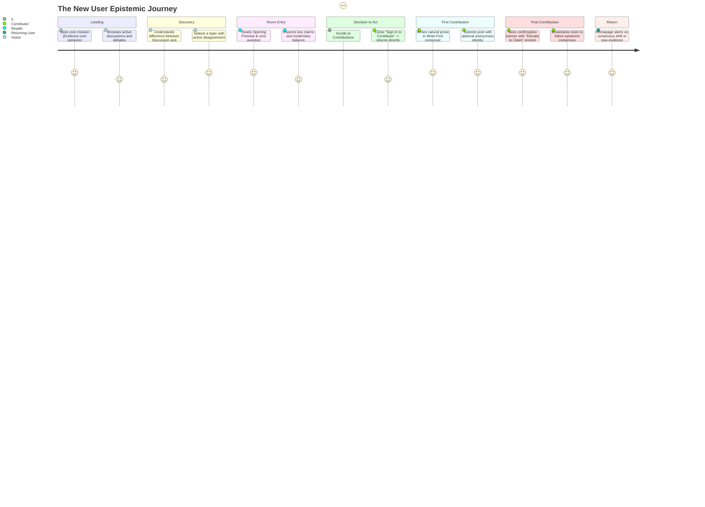

# New User → First Meaningful Contribution: Redesign Specification

**Milestone Context:** Commit `f4c887e` (*Establish Discora core product foundation*)  
**Objective:** Translate behavioral audit findings into a coherent, progressive-disclosure UX architecture without diluting epistemic rigor  
**Date:** September 2026

---

## 1. Design Vision & Core Philosophy

Discora’s purpose is **"Understanding over engagement, evidence over opinions, clarity over activity, and questions before conclusions."** 

The audit established that Discora’s underlying architecture is exceptionally sound:
- Claims are strictly typed and backed by verifiable evidence.
- Debates balance Proposition and Opposition with mathematical rigor.
- Inquiries introduce formal dialectical testing.
- The Write-First flow protects conversational fluidity before formal structuring.

However, the user experience currently presents an **unramped cliff**: users are confronted with all conceptual layers at once or locked out silently by unauthenticated barriers.

### The Redesign Mandate
The goal of this redesign is **STRUCTURE WITHOUT COGNITIVE OVERLOAD** through **Progressive Disclosure**:
1. **Never hide the entry door:** Unauthenticated guests must always see the path to participation.
2. **Layer structure onto natural dialogue:** Allow users to converse first, then guide them to elevate insights into claims and evidence.
3. **Clarify terminology contextually:** Explain what a concept means *at the moment the user encounters it*, not in an academic glossary.
4. **Close the epistemic loop:** When a contribution is made, reward the user with understanding, not dopamine—show where their idea sits, how it can be evidenced, and when consensus shifts.

---

## 2. Conceptual Clarification & Structural Integrity

A foundational requirement of this redesign is evaluating whether complex concepts should be consolidated or preserved.

### A. Discussion vs. Debate: Preserved with Explicit Archetype Framing
- **Evaluation:** Should Discussions and Debates be merged into a single "Room" type?
- **Decision:** **NO. Preserve both.**
  - A **Discussion** is an *exploratory synthesis*. It asks open questions (*"Should AI content be labeled?"*), gathers varied perspectives, uncovers edge cases, and maps emerging claims.
  - A **Debate** is an *adversarial clash*. It pits two incompatible theses against each other (*Proposition vs. Opposition*), measures evidence weight on a balance scorecard, and requires rigorous justification to switch stances.
  - Merging them would destroy the disciplined adversarial mechanics of Debates or force Discussions into artificial binary binaries.
- **Redesign Solution (Progressive Framing):**
  - Add archetype badge subtitles on feeds and room headers:
    - Discussion Badge: `Exploratory Inquiry · Multi-Perspective Synthesis`
    - Debate Badge: `Structured Clash · Proposition vs. Opposition`
  - In discovery feeds, include an expandable 1-line explainer:
    - *"Discussions map open questions and emerging consensus. Debates evaluate competing arguments with evidence scorecards."*

### B. Questions vs. Inquiries: Preserved with Distinct Epistemic Roles
- **Evaluation:** Should Discussion "Questions" and Debate "Inquiries" be merged into a single model?
- **Decision:** **NO. Preserve both with distinct contextual labeling.**
  - **Discussion Questions (`DiscussionQuestion`):** These are *guiding prompts* that steer collaborative discovery into sub-facets of a broad topic.
  - **Debate Inquiries (`inquiry_items`):** These are *epistemic challenges* with rigorous typology (`factual_clarification`, `counter_evidence`, `source_request`, `premise_challenge`) that require structured responses and undergo lifecycle states (`open`, `satisfied`, `refuted`, `closed`).
- **Redesign Solution (Clarified UI Micro-Copy):**
  - Discussion Tab Label: **"Guiding Questions"** with subtitle: *"Key sub-questions explored in this room to unpack the premise."*
  - Debate Tab Label: **"Inquiries & Challenges"** with subtitle: *"Formal requests for evidence, factual clarification, or premise verification."*

### C. Claims vs. Contributions: Unified via Write-First Progressive Escalation
- **Evaluation:** Why do users see both "Claims" and "Contributions" tabs?
- **Decision:** **Preserve the distinction, but eliminate the cognitive collision through Write-First onboarding.**
  - **Contributions:** The conversational thread where participants share natural prose, preliminary hypotheses, and informal reflections.
  - **Claims:** The distilled, atomic truth assertions extracted from contributions, categorized by type, and tied directly to citations.
- **Redesign Solution (The Epistemic Ramp):**
  - Replace the question *"Should I post a Claim or a Contribution?"* by establishing a clear universal mental model:
    > **"Contributions are where dialogue starts. Claims are what we agree or disagree on."**
  - All participation begins in **Contributions**. Once posted, the interface proactively offers the author or community the ability to **"Elevate to Claim"**.

---

## 3. The New User Journey Narrative



---

## 4. Detailed Stage-by-Stage UX Redesign

### Stage 1: Landing Page (`/`) — Zero-Delay First Impression
- **Problem Solved:** Blank spinner during auth resolution (Finding P1.1).
- **Design Specification:**
  - The root layout immediately serves the **Guest Hero and Discovery Shell** statically or with instant client hydration.
  - The Hero is enhanced with a 3-step visual epistemic ramp:
    ```text
    1. Read the Premise → 2. Examine Verified Evidence → 3. Track Consensus Evolution
    ```
  - Under the metrics bar, replace mysterious terms like *"Satisfied Today"* with plain, informative phrasing:
    - *Claims Backed by Evidence* (e.g., 42)
    - *Inquiries Answered* (e.g., 18)
    - *Debates with Active Balance* (e.g., 12)
  - If a logged-in user is detected, personal widgets seamlessly animate into place without blocking the initial view.

---

### Stage 2: Room Discovery (`/discussions`, `/debates`, `/search`)
- **Problem Solved:** Inability to distinguish room archetypes; blank search page.
- **Design Specification:**
  - **Discussions Feed Header:**
    - Subtitle: *"Open exploration of multi-dimensional topics. Map perspectives, propose guiding questions, and build shared understanding."*
  - **Debates Feed Header:**
    - Subtitle: *"Binary evaluation of opposing positions. Weigh arguments with evidence, test premises with inquiries, and track position shifts."*
  - **Search Initial State:**
    - When search input is empty, render curated prompt cards:
      - *Explore by Topic:* `#technology`, `#ethics`, `#science`, `#governance`
      - *Explore by Type:* "Find Claims with Peer-Reviewed Evidence", "Find Debates Nearing Closing"

---

### Stage 3: Room Entry & Orientation — Bounded Contextual Clarity
- **Problem Solved:** Information overload; confusion over which tab to view first.
- **Design Specification:**
  - **Room Header Badges:**
    - Discussion: `[Discussion Room]` `[Topic: #technology]` `[15 Claims · 4 Evidence · 2 Questions]`
    - Debate: `[Debate Room]` `[Status: Active]` `[Proposition: 65% · Opposition: 35%]`
  - **Overview Tab Role:**
    - The Overview tab serves as the **Executive Briefing**.
    - It answers: *"What is the core premise? What are the strongest claims? What evidence is on the table?"*
    - Each overview card includes a prominent action link to dive deep into that specific section:
      - *Key Claims Card* → `"View all 15 claims & vote on consensus →"`
      - *Evidence Vault Card* → `"Examine all 4 verified sources →"`
      - *Conversation Card* → `"Join dialogue in Contributions →"`

---

### Stage 4: Participation Decision — The Open Door (P0 Fix)
- **Problem Solved:** Silent disappearance of contribution composer for guests (Finding P0.1).
- **Design Specification:**
  - When an unauthenticated visitor scrolls to the Contributions section on any room page, the interface renders a high-visibility, welcoming **`GuestContributionPrompt`** card:
    ```text
    ┌────────────────────────────────────────────────────────────────────────┐
    │  💬  Join the Conversation in this Discussion                          │
    │                                                                        │
    │  Share your perspective, highlight key claims, and verify evidence.    │
    │  Discora is free, open, and focused on understanding over engagement.   │
    │                                                                        │
    │  [ Create Account ]   [ Sign In ]   (Redirections return here)         │
    └────────────────────────────────────────────────────────────────────────┘
    ```
  - Both buttons carry `?redirectedFrom=/discussions/[slug]#contributions` so the user returns exactly to the composer upon authenticating.

---

### Stage 5: First Contribution & The Write-First Escalation
- **Problem Solved:** Post-contribution dead end; lack of guidance on turning comments into claims.
- **Design Specification:**
  - **Step 1: Write Naturally:**
    - The composer remains simple, uncluttered, and low-friction:
      - Placeholder: *"Share your structured thoughts, counter-points, or insights on this topic..."*
      - Anonymous contribution toggle with clear explanatory subtext.
  - **Step 2: Instant Confirmation Banner:**
    - Upon submitting, the comment renders at the top of the thread with a transient banner for first-time authors:
      ```text
      ✓ Contribution posted to the conversation!
      Tip: Does your comment make a distinct factual or logical point? 
      Click "Extract Claim" below your post to elevate it into the room's formal Claims registry.
      ```
  - **Step 3: Seamless Claim Elevation (`ExtractClaimModal`):**
    - Clicking `Extract Claim` retains its existing functionality, but receives friendly helper tooltips explaining the claim types:
      - *Fact:* A verifiable empirical observation.
      - *Value Judgment:* A normative or ethical assessment.
      - *Policy:* A proposed course of action or rule.

---

### Stage 6: The Epistemic Return Loop (No Engagement Traps)
- **Problem Solved:** Cold-start void for new users on logged-in homepage; lack of epistemic retention triggers.
- **Design Specification:**
  - **The "Follow Topic / Bookmark Room" Action:**
    - In the sticky room header, provide a clean bookmark icon labeled **"Follow for Updates"**.
    - Hover tooltip: *"Receive epistemic updates when new evidence is added or consensus shifts."*
  - **Seeding the Personal Homepage:**
    - If a user has contributed to or followed a room, their logged-in homepage displays:
      - **"Rooms You Follow"** card with status indicators (e.g., *"1 new evidence item added since your last visit"*).
      - **"Your Contributions"** card showing whether their comment was replied to or elevated into a claim.
  - **Zero Gamification Guarantee:**
    - No notification red badges with arbitrary numbers.
    - Notifications are exclusively factual: *"A counter-evidence item was linked to Claim #3 in 'AI Content Labeling'."*

---

### Stage 7: Mobile Optimization (375px & 390px)
- **Problem Solved:** 7-column bottom nav crowding; hidden horizontal tabs; text overflows.
- **Design Specification:**
  - **Bottom Navigation Simplification:**
    - Streamline `MobileNav` to **5 ergonomic items**:
      1. `Home`
      2. `Discussions`
      3. `Debates`
      4. `Search`
      5. `Profile` (Settings accessible directly inside Profile)
    - Move `Create` to a floating action button on feed pages or as a top-right header action.
  - **Horizontal Section Tab Scroll Indicator:**
    - Add a subtle right-edge fade gradient (`mask-image: linear-gradient(to right, black 85%, transparent 100%)`) to visually communicate that tabs continue off-screen.
  - **Defensive Text Wrapping:**
    - Add `break-words`, `hyphens-auto`, and `overflow-hidden` to all card containers in `OpeningPremise` and `DebatePremise`.

---

## 5. Architectural Non-Regression Verification

This redesign strictly adheres to all signed-off architectural boundaries:
- **No changes to Supabase schema or RLS policies.**
- **No changes to backend services or pagination RPCs.**
- **No merging of database tables or entity models.**
- **Preserves existing deep-link URLs and section routes.**
- **Preserves 50-character side switch rationale and cooldown triggers.**
