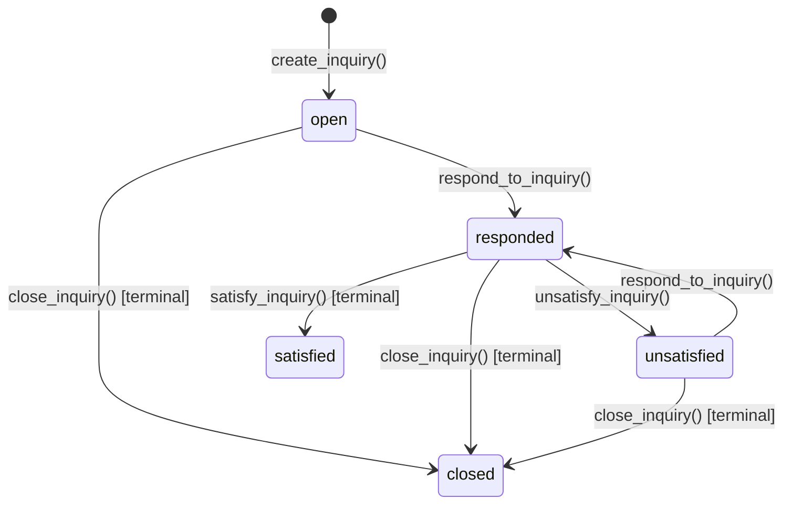

# PHASE 3C-B.3: INQUIRY RESPONSE SATISFACTION AUDIT

**Status**: AUDIT COMPLETE — SPECULATIVE IMPLEMENTATION BLOCKED  
**Date**: September 2026  
**Decision**: **DEFER**  
**Context**: Evaluation of Phase 3C-B.3 ("Inquiry Response Satisfaction") following sign-off of Phase 3C-A, Phase 3C-B.1 (`a2d2e32`), and Phase 3C-B.2 (`b07b725`).  
**Constraint**: Audit and design only. Zero application source code changes, zero database migrations, zero RPC modifications, zero commits.

---

## 1. Executive Summary

Phase 3C-B.3 investigates whether **"Inquiry Response Satisfaction"** is a sound, trustworthy epistemic return signal for Discora, and what technical architecture would be required to support it.

The platform objective is:
> *Discora should encourage users to return because their understanding is evolving, not because the product demands engagement.*

### Key Finding:
The audit revealed a fundamental structural asymmetry in the current data model:
1. **Actor Paradox for the Inquirer**:
   - `satisfy_inquiry` and `unsatisfy_inquiry` RPCs are strictly restricted to the **original inquirer** (`inquiry_items.created_by = auth.uid()`).
   - The inquirer is the sole user who marks an inquiry satisfied.
   - For the inquirer, arriving responses are already surfaced in real time on the homepage via `get_my_inquiry_responses()` (*"Responses to My Inquiries"*).
   - Once the inquirer evaluates the response and clicks "Mark Satisfied" or "Needs Detail", sending a return signal to that same inquirer saying *"Your inquiry was marked satisfied"* is 100% circular, redundant, and adds **zero epistemic delta**.
2. **Attribution & Baseline Vacuum for the Responder**:
   - The user who genuinely benefits from knowing an inquiry was satisfied is the **responder** (User B), whose intellectual effort successfully resolved the challenge.
   - However, `satisfy_inquiry` operates strictly on `inquiry_items.id`, **not** on individual responses (`inquiry_responses.id`).
   - If multiple community members responded to an inquiry, marking the inquiry satisfied attributes satisfaction coarsely to the entire thread. Discora cannot currently prove *which* response satisfied the inquiry.
   - Furthermore, there is **zero read/seen tracking** and **no dedicated status transition timestamp** (`satisfied_at`).
   - Under the current zero-migration schema, querying satisfaction for responders would produce either permanent zombie cards (showing indefinitely) or arbitrary windowed cards (showing for $N$ days regardless of visits), attributing unearned resolution to all responders.

### Recommendation:
**DEFER Phase 3C-B.3.**  
Do not ship an ungrounded zero-migration signal that emits circular or coarsely-attributed alerts. The signal should be implemented only after introducing response-level satisfaction attribution or an immutable status transition event log.

---

## 2. Current Architecture & Context

As of commit `b07b725`, Discora’s personalized return signals in `src/features/homepage/components/logged-in-homepage.tsx` consist of:
1. **Inquiries on Your Claims** (Phase 3C-B.1): Surfaces challenges opened by others on claims the user authored (`ii.target_claim_id = c.id AND c.created_by = auth.uid()`).
2. **New Evidence on Claims You Evaluated** (Phase 3C-B.2): Surfaces counter-grounding or supporting evidence attached to claims after the user's latest vote (`ce.created_at > cv.updated_at`).
3. **Responses to My Inquiries** (Phase 3C-A): Surfaces inquiries opened by the user that have received responses awaiting evaluation (`ii.created_by = auth.uid() AND ii.status = 'responded'`).
4. **My Open Inquiries** (Phase 3C-A): Surfaces the user's open, unresolved questions (`ii.created_by = auth.uid() AND ii.status NOT IN ('satisfied', 'closed')`).
5. **My Understanding Evolved** (Phase 3C-A): Surfaces shifts in consensus on claims the user evaluated.
6. **Debates Needing Attention** (Phase 3C-A): Surfaces unbalanced argument distribution in debates the user participates in.

---

## 3. Actual Schema Findings (Phase 1 Deep-Dive)

A line-by-line inspection of `supabase/migrations/202606120001_create_inquiry_tables.sql` and related RPCs verified the following 22 ground truths:

1. **Fields on `inquiry_items`**:
   - `id` (uuid, primary key)
   - `room_id` (uuid, references `public.rooms(id)`)
   - `created_by` (uuid, references `auth.users(id)`)
   - `inquirer_side` (text, default `'inquiry'`)
   - `inquiry_type` (text, check constraint: `'clarification'`, `'evidence_request'`, `'assumption_check'`)
   - `content` (text, 10–2000 chars)
   - `target_claim_id` (uuid, references `public.claims(id)`)
   - `status` (text, check constraint: `'open'`, `'responded'`, `'satisfied'`, `'unsatisfied'`, `'closed'`)
   - `created_at` (timestamptz, default `now()`)
   - `updated_at` (timestamptz, default `now()`)

2. **Fields on `inquiry_responses`**:
   - `id` (uuid, primary key)
   - `inquiry_item_id` (uuid, references `public.inquiry_items(id)`)
   - `created_by` (uuid, references `auth.users(id)`)
   - `content` (text, 10–5000 chars)
   - `created_at` (timestamptz, default `now()`)
   *(Note: No `updated_at`, `status`, `is_satisfied`, or `is_retracted` column exists on responses).*

3. **Inquiry Status Representation**:
   - Managed as a single text column `inquiry_items.status` with 5 discrete values: `'open'`, `'responded'`, `'satisfied'`, `'unsatisfied'`, `'closed'`.

4. **Mechanism of `satisfy_inquiry`**:
   - Strictly enforces `auth.uid() = inquiry_items.created_by`.
   - Updates `inquiry_items`: `status = 'satisfied'`, `updated_at = now()`.
   - Requires antecedent `status = 'responded'`; throws `'invalid_state'` otherwise.
   - Emits an internal reputation ledger event for the inquirer: `create_reputation_event(v_user_id, 'INQUIRY_SATISFIED', 2, ...)`.
   - Does **not** record which response or responder triggered satisfaction.

5. **Mechanism of `unsatisfy_inquiry`**:
   - Strictly enforces `auth.uid() = inquiry_items.created_by`.
   - Updates `inquiry_items`: `status = 'unsatisfied'`, `updated_at = now()`.
   - Requires antecedent `status = 'responded'`; throws `'invalid_state'` otherwise.
   - Emits no reputation event.

6. **Authorization to Satisfy / Unsatisfy**:
   - Exclusively the **inquiry creator** (`inquiry_items.created_by = auth.uid()`). No other role (room creator, claim author, moderator) can call these functions.

7. **Multiple Responses**:
   - Supported. 1-to-many relationship (`inquiry_responses.inquiry_item_id`).

8. **Satisfaction After Multiple Responses**:
   - Supported, but coarse. The status transition is global to the `inquiry_items` row.

9. **Satisfaction Timestamps**:
   - None exists. Only generic `inquiry_items.updated_at` is updated.

10. **Retention of Satisfaction History**:
    - **None**. The schema does not retain state transition logs.

11. **State Repeatability**:
    - `'satisfied'` is terminal in the current RPC design (`respond_to_inquiry` throws `'inquiry_closed'` if status is `'satisfied'`).
    - `'unsatisfied'` is cyclic: an inquiry marked `'unsatisfied'` can receive a new response, flipping it back to `'responded'`, which can then be marked `'satisfied'` or `'unsatisfied'` again.

12. **Event / History Tables**:
    - No general status transition table exists. `reputation_events` tracks points awarded to the inquirer, but cannot serve as a reliable multi-user signal index.

13. **Last-Seen / Read Tracking**:
    - **Zero**. Discora deliberately stores no read receipts or client view logs.

14. **Inquirer Identification**:
    - Deterministic via `inquiry_items.created_by`.

15. **Responder Identification**:
    - Deterministic via `inquiry_responses.created_by`.

16. **User Deletion / Anonymization**:
    - Foreign keys cascade on delete. `inquiry_items` lacks an `identity_mode` column; author profiles display `"Contributor"` if deleted or null.

17. **Retracted Target Claim**:
    - Target claims have `claims.is_retracted (boolean)`. Inquiries on retracted claims must be excluded from active return loops.

18. **Inaccessible / Archived Rooms**:
    - Governed by standard Discora visibility: `(r.visibility = 'public' AND r.status <> 'archived') OR r.created_by = auth.uid()`.

19. **Moderation Filtering**:
    - Moderation flags exist for `claim_id` and `evidence_id`, but not directly for `inquiry_item_id`. However, if the target claim is hidden (`resolved_hidden`), associated inquiries must be suppressed.

20. **Debate-Origin Inquiries**:
    - Belong to a debate room (`r.room_type = 'debate'`); track `inquirer_side` (`'proposition'`, `'opposition'`, `'inquiry'`). Deep links point to `/inquiries/[id]` which renders debate context.

21. **Discussion-Origin Inquiries**:
    - Belong to a discussion room (`r.room_type = 'discussion'`); deep links point to `/inquiries/[id]` with discussion context.

---

## 4. Current Inquiry Lifecycle & State Machine

---

## 5. Epistemic Value Audit (Phase 2)

| Scenario | Actor Affected | Epistemic Significance | Evaluation |
| :--- | :--- | :--- | :--- |
| **A. Response received** | Inquirer | High (Awaiting challenge assessment) | **Already fully handled** by Phase 3C-A `get_my_inquiry_responses()`. |
| **B. Inquiry marked satisfied** | Inquirer | None (Self-action) | **No meaningful signal**. The user who clicked the button does not need a notification that they clicked it. |
| **B2. Inquiry marked satisfied** | Responder(s) | High (Intellectual closure) | **High epistemic value**, but currently **misleading** due to coarse attribution across multiple responders. |
| **C. Inquiry marked unsatisfied** | Inquirer | None (Self-action) | **No meaningful signal**. Handled via reopening the inquiry in `get_my_open_inquiries()`. |
| **C2. Inquiry marked unsatisfied** | Responder(s) | Moderate (Feedback: answer incomplete) | **Moderate epistemic value**, but currently carries high social-friction / negative-affect risk if ungrounded. |
| **D. Inquiry closed without satisfaction** | Responder(s) | Low / Ambiguous | **No meaningful signal**. Inquirer abandoned the thread. |
| **E. Multiple responses received** | All actors | Ambiguous | **Potentially misleading**. Satisfying the inquiry credits all responders equally, even low-quality or tangential answers. |
| **F. Satisfaction state changes** | All actors | Cyclical | **High risk of flapping/stale noise** without an event stream. |
| **G. Response exists but unread** | Inquirer | Actionable | **Already fully handled** by Phase 3C-A. |
| **H. Low-quality response** | Inquirer | Negative | Handled via marking "Needs Detail" or closing. |
| **I. Instant satisfaction** | Responder | High | Indicates clear, immediate resolution. |
| **J. Unsatisfied after response** | Inquirer | Actionable | Prompts inquirer to refine claim or question. |

---

## 6. Baseline / Temporal Analysis (Phase 3)

### Evaluation of Candidate Options

#### Option A: Use Existing State (`ii.status = 'satisfied' AND ii.updated_at`)
- **For Inquirer**: 100% false-positive redundancy (notifying user of their own prior button press).
- **For Responder**: Cannot establish whether the user has already seen the satisfaction state. Results in **permanent zombie cards** on the homepage.
- **Verdict**: **REJECT**.

#### Option B: Bounded Time Window (`ii.updated_at >= now() - interval '7 days'`)
- **For Responder**: Card appears continuously for 7 days regardless of how many times the user views it. If the user is on vacation for 8 days, they miss it entirely.
- **Multiple Responders**: If User B posted a one-line comment and User C provided a formal proof, both receive identical "Your response satisfied the inquiry" cards.
- **Verdict**: **UNSOUND**.

#### Option C: Add Event / History Table (`inquiry_status_events`)
- Records `(id, inquiry_item_id, actor_id, from_status, to_status, created_at)`.
- Eliminates state flapping and provides deterministic timestamps.
- Still lacks response-level attribution unless linked to `inquiry_responses.id`.
- **Verdict**: **DEFER** (requires schema migration).

#### Option D: Response-Level Attribution Column (`inquiry_items.satisfied_response_id`)
- Adds `satisfied_response_id uuid references inquiry_responses(id)` and `satisfied_at timestamptz`.
- Pinpoints the exact response that resolved the inquirer's challenge.
- Enables clean, mathematically sound responder return loops.
- **Verdict**: **RECOMMENDED ARCHITECTURAL TARGET** (requires schema migration).

---

## 7. Comparison with Existing Phase 3C Signals

| Feature | Phase 3C-B.1 (Inquiries on My Claims) | Phase 3C-B.2 (New Evidence on Voted Claims) | Phase 3C-B.3 (Inquiry Response Satisfaction) |
| :--- | :--- | :--- | :--- |
| **Target User** | Claim Author | Claim Voter | Responder |
| **Underlying Event** | New row in `inquiry_items` targeting user's claim | New row in `claim_evidence` after `claim_votes.updated_at` | Status change on `inquiry_items` |
| **Temporal Baseline** | Natural state: `ii.status IN ('open', 'unsatisfied')` | Mathematical: `ce.created_at > cv.updated_at` | **MISSING** (No `satisfied_at` or read-state) |
| **Attribution** | 1:1 (Claim $\leftrightarrow$ Inquiry) | 1:1:1 (User $\leftrightarrow$ Vote $\leftrightarrow$ Evidence) | **Coarse (1:N responses without attribution)** |
| **Zero-Migration Viability** | **100% Sound** | **100% Sound** | **UNSOUND / MISLEADING** |

---

## 8. Detailed Edge Case Matrix (Phase 6)

1. **Inquiry with zero responses**: Status cannot be `'responded'`, `'satisfied'`, or `'unsatisfied'`. Correctly ignored.
2. **One response, marked satisfied**: Clean 1:1 attribution in theory, but indistinguishable in schema from N-response cases.
3. **One response, marked unsatisfied**: Re-opens inquiry to community. Handled for inquirer via `get_my_open_inquiries()`.
4. **Multiple responses**: Schema records satisfaction at inquiry level only. Attributing to all responders is misleading.
5. **Inquiry closed without satisfaction**: Disappears from open lists; no satisfaction signal emitted.
6. **Inquirer authored a response**: If an inquirer replies to their own inquiry, a responder query would match `ir.created_by = auth.uid()`, creating self-notification.
7. **Retracted claim**: Target claim retracted (`c.is_retracted = true`). Must be excluded.
8. **Moderated content**: Target claim hidden by moderation. Must be excluded.
9. **Private / Archived room**: Must strictly obey Discora room visibility.
10. **Zero production data**: Must gracefully return empty list without layout shift or console errors.

---

## 9. Security & Privacy Audit

1. **Identity & Anonymity**:
   - Inquiries and responses store `created_by` linking to `auth.users(id)`.
   - Profiles must be joined safely.
2. **Room Privacy**:
   - Any future RPC must include:
     `((r.visibility = 'public' AND r.status <> 'archived') OR r.created_by = auth.uid())`.
3. **No Information Leakage**:
   - Personalization must strictly derive from `auth.uid()`, never taking a client-supplied `user_id`.

---

## 10. Audit Conclusion & Final Recommendation

### Decision: **DEFER**

### Reason:
1. **Targeting the Inquirer is redundant**: The inquirer initiates the satisfaction action; surfacing it to them as a return signal is circular and adds zero epistemic value. Arriving responses are already surfaced via Phase 3C-A's `get_my_inquiry_responses()`.
2. **Targeting the Responder is technically premature without migration**: 
   - No `satisfied_response_id` exists to identify *which* responder resolved the inquiry.
   - No `satisfied_at` timestamp exists to establish freshness.
   - No read/dismissed mechanism exists to retire viewed signals.
3. Shipping a zero-migration approximation using a 7-day sliding window on `inquiry_items.updated_at` would violate Discora's core engineering principles by generating false-attribution noise and zombie cards.

### Minimum Future Data-Model Requirements:
To implement Phase 3C-B.3 safely in a future milestone, Discora requires:
- Migration adding `satisfied_response_id uuid references public.inquiry_responses(id)` and `satisfied_at timestamptz` to `public.inquiry_items`.
- Updating `satisfy_inquiry(p_inquiry_item_id uuid, p_response_id uuid)` to accept and store the specific satisfying response.
