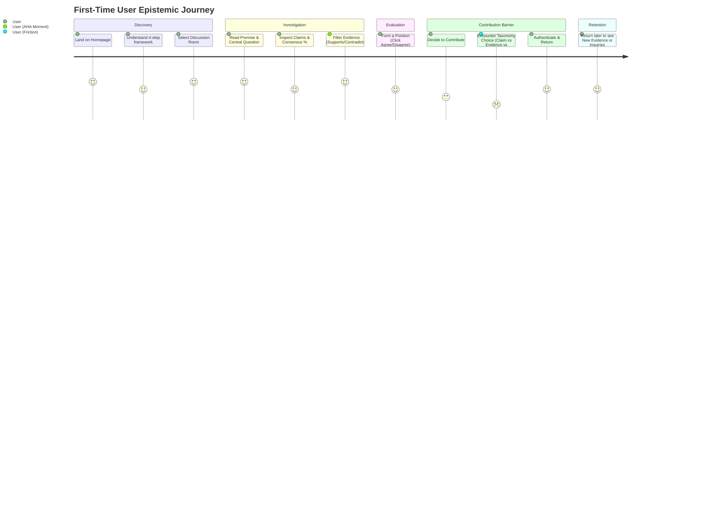

# PHASE 4: FIRST-TIME USER BEHAVIORAL UX AUDIT

**Status**: AUDIT COMPLETE — PRODUCT & BEHAVIORAL EVALUATION ONLY  
**Date**: September 2026  
**Auditor Persona**: First-Time Visitor (Technically competent, zero prior Discora context)  
**Constraint**: Audit only. Zero source code changes, zero schema migrations, zero RPC changes, zero commits.

---

## 1. Executive Summary

Discora was evaluated from the empirical perspective of a first-time visitor. The audit examined whether a user encountering the platform for the first time can intuitively understand:
1. What Discora is and why it exists.
2. How its core ontology (Questions $\rightarrow$ Claims $\rightarrow$ Evidence $\rightarrow$ Understanding) operates.
3. Where to begin reading and how to inspect structured disagreement without cognitive collapse.
4. How to contribute meaningfully without needing to master an academic argumentation framework beforehand.
5. Why they should return later based purely on epistemic evolution rather than gamified dopamine loops.

### Key Behavioral Diagnoses:
- **Strongest Asset**: **Clear Structural Differentiation**. Within 15 seconds, a novice understands that Discora is *not* Reddit, Twitter, or a standard threaded forum. Arguments are modular, claims are explicit, and evidence is cataloged in an Evidence Bank rather than buried in comment threads.
- **Primary AHA Moment**: The **Evidence Bank filter interaction** (`/discussions/[slug]/evidence`). Toggling between *Supports*, *Contradicts*, and *Context* instantly transforms "reading comments" into "investigating the factual grounding of a thesis".
- **Primary Behavioral Barrier (P1)**: **Taxonomy Pre-Selection Friction**. When an unauthenticated or newly registered user wants to contribute, they face an upfront taxonomy choice (Question vs. Claim vs. Evidence vs. Stance) before writing a single word. This demands conceptual expertise before engagement.
- **Secondary Barrier (P1)**: **Vocabulary Conflation between Questions & Inquiries**. The distinction between *Discussion Questions* (topic framing) and *Structured Inquiries* (claim-level challenges) is conceptually pure but introduced without enough contextual staging, leading novices to wonder "why are there two kinds of questions?".
- **Return Loop Strength**: The personal return signals (*Inquiries on Your Claims*, *New Evidence on Voted Claims*, *Understanding Evolved*) are philosophically rigorous and free of notification spam, but remain invisible until a user makes their first stance commitment or claim.

---

## 2. Methodology & Test Persona

### Persona Profile:
- **Background**: Technically literate, experienced with Reddit, Hacker News, Wikipedia, and Substack.
- **Knowledge Level**: Zero familiarity with Discora, zero internal vocabulary knowledge, has not read any product specification or developer docs.
- **Behavioral Objective**: Understand a complex, controversial question (*"Should AI-generated content be clearly labeled online?"*), see the strongest arguments on both sides, inspect the evidence, and evaluate whether they can contribute.

### Evaluated States:
- **A. Unauthenticated Guest Visitor**: First visit via public landing page.
- **B. Newly Registered User**: Authenticated with clean, zero-contribution account.

### Routes Audited:
- `/` (Public Guest Homepage & Authenticated Logged-In Homepage)
- `/discussions` (Browse Discussions index)
- `/discussions/should-ai-generated-content-be-clearly-labeled-online` (Overview)
- `/discussions/should-ai-generated-content-be-clearly-labeled-online/claims` (Claims tab)
- `/discussions/should-ai-generated-content-be-clearly-labeled-online/evidence` (Evidence Bank)
- `/discussions/should-ai-generated-content-be-clearly-labeled-online/questions` (Discussion Questions)
- `/discussions/should-ai-generated-content-be-clearly-labeled-online/contributions` (Room Contributions)
- `/debates` (Browse Debates index)
- `/debates/ai-is-superior-to-humans` (Debate room, proposition vs opposition, scorecard)
- `/inquiries/[id]` (Structured Inquiry view)
- `/search` (Search & Discovery)
- `/login` & `/register` (Authentication context preservation)

---

## 3. First 30 Seconds: The Onboarding Flash Test

| Time Interval | User Observation | Novice Perception & Comprehension | Friction / Cognitive Gap |
| :--- | :--- | :--- | :--- |
| **0 – 5 Seconds** | Logo slogan: *"Understanding over engagement"*. Hero: *"Structured Discussion & Debate — A platform for evidence-based dialogue."* | "This is an intellectual discussion site, not social media. It wants reasoned debate rather than engagement bait." | Extremely high clarity on platform stance. |
| **5 – 15 Seconds** | 4-step card grid: `1. Questions` $\rightarrow$ `2. Claims` $\rightarrow$ `3. Evidence` $\rightarrow$ `4. Understanding`. | "Discussions here aren't walls of text. A question is broken into claims, and claims are backed by evidence." | The progression is logical and immediately communicates structure over chaos. |
| **15 – 30 Seconds** | Active room cards (*"Should AI-generated content be clearly labeled online?"*, *"AI is superior to humans"*), CTA buttons (*Browse Discussions*, *Explore Debates*). | "I can either explore open topics (Discussions) or structured binary arguments (Debates). I should click into a discussion to see how it works." | The choice between Discussion and Debate is clear, but subtle nuances of room status require clicking through. |

### Does Discora Resemble Other Platforms?
- **Reddit / Hacker News**: **NO.** There is no upvote-driven feed, no karma score hero, and no nested comment tree chaos.
- **Twitter / X**: **NO.** No character limits, no follower counts, no viral retweet mechanics.
- **Discord / Slack**: **NO.** No real-time chat stream.
- **Kialo / Arguman**: **MODERATE SIMILARITY.** Shares the modular argument philosophy, but Discora feels more readable because it uses room premises and evidence tabs rather than an overwhelming infinite zoom tree.

---

## 4. Finding the Right Entry Point

### The Novice Question: *"If I wanted to understand a difficult question, where do I click?"*
1. **Homepage Hero CTAs**:
   - `Browse Discussions`: Directs to `/discussions` with topic filter chips.
   - `Explore Debates`: Directs to `/debates` with active status filters.
   - `Search` (or `Ctrl+K`): Opens instant search modal.
2. **Direct Room Card**:
   - The first active discussion card (*"Should AI-generated content be clearly labeled online?"*) is immediately clickable.
3. **Click Depth to Meaningful Content**:
   - **1 Click**: Homepage $\rightarrow$ Discussion Overview.
   - From Overview, the central question, premise, and top claim summaries are visible within the initial scroll window.

### Verdict on Entry Point:
**Optimal**. The user does not face decision paralysis. The featured discussion cards act as natural gateways.

---

## 5. First Discussion Experience (`/discussions/[slug]`)

### 1. Central Question & Premise:
- **Observation**: The central question is displayed in `<h1>` typography, immediately followed by the *Opening Premise* (e.g., balancing transparency/safety against creative freedom and practical enforcement).
- **Novice Comprehension**: **High (9/10)**. The premise sets a calm, analytical tone. It signals that both perspectives have merit before any claim is evaluated.

### 2. "Where Should I Start?" Guidance:
- **Observation**: The Overview tab provides a 4-step orientation card:
  1. *Read the premise above*
  2. *Explore questions*
  3. *Examine claims & evidence*
  4. *Contribute if you have something useful to add*
- **Novice Comprehension**: Very effective for first-time orientation. It prevents the common forum habit of immediately scrolling to the bottom to write an ungrounded opinion.

### 3. Room Navigation Tabs:
- Horizontal navigation bar: `Overview` | `Claims` | `Evidence` | `Discussion Questions` | `Contributions`.
- **Friction Point**: The difference between `Discussion Questions` and `Claims` is clear, but `Contributions` feels ambiguous to a novice. A user wonders: *"Aren't claims and evidence also contributions?"*

### 4. Claims List & `% Agree`:
- Claims display a `% Agree` consensus bar and `Agree` / `Disagree` evaluation buttons.
- **Novice Comprehension**: Clear, but the novice must realize that clicking `Agree` or `Disagree` is an epistemic stance, not a social upvote/downvote.

---

## 6. First Contribution Test

### The Novice Dilemma: *"What would I write here?"*
1. **Unauthenticated Flow**:
   - When a guest clicks `Add Claim`, `Add Evidence`, or `Add Question`, they are greeted with an informative, contextual banner:
     *"Sign in to share your perspective, help answer questions, or contribute evidence."*
   - Clicking `Sign In` passes `?redirectedFrom=%2Fdiscussions%2F...`.
   - **Context Preservation**: Post-login, the user is redirected back to the exact discussion room.

2. **Taxonomy Friction (P1)**:
   - When preparing to contribute, Discora asks the user to choose their container:
     - Are you posting a **Claim**?
     - Are you adding **Evidence**?
     - Are you asking a **Discussion Question**?
     - Are you opening a **Structured Inquiry**?
   - **Novice Reaction**: Cognitive hesitation. A user who has an insight (e.g., *"Watermarking doesn't work because open-source models can strip metadata"*) doesn't instinctively know whether that is a *Counterpoint Claim*, an *Evidence Item*, or an *Assumption Check Inquiry*.
   - **Intended Design**: Discora wants discrete claims backed by sources.
   - **Behavioral Gap**: Forcing taxonomy selection before drafting creates blank-page anxiety.

---

## 7. Evidence Experience: Research Workspace vs Comment Stream

### The Test Question: *"If I disagree with a claim, how do I investigate it?"*
- Navigating to `/discussions/[slug]/evidence` reveals the **Evidence Bank**.
- **Visual Presentation**:
  - Filter tabs: `All` | `Supports` (Emerald) | `Contradicts` (Rose) | `Context` (Violet).
  - Search input: `Filter evidence by keyword, source, or claim...`.
- **Behavioral Impact**:
  - This is the **most impressive and differentiated part of Discora**.
  - Filtering by `Contradicts` instantly isolates empirical challenges.
  - Each evidence item quotes the source, links to the external URL, tags the evidence type (`empirical_study`, `expert_testimony`, `data_analysis`), and explicitly shows which claim it is attached to.
  - It successfully feels like **researching a disagreement**, completely distinct from reading angry replies under a comment.

---

## 8. Questions vs. Structured Inquiries

| Concept | Location in UI | Intended Purpose | Novice Perception | Cognitive Friction |
| :--- | :--- | :--- | :--- | :--- |
| **Discussion Question** | Room Tab: `Discussion Questions` | Topic-level inquiry defining the scope of the room. | "A question about the main topic." | Low (familiar from FAQ / forum questions). |
| **Structured Inquiry** | Claim Card menu: `Raise Structured Inquiry` | Targeted epistemic challenge to a specific claim. | "Another question, but inside a claim." | **Moderate (P1)**: User wonders why it is called an 'Inquiry' instead of 'Questioning this claim'. |

### Finding:
The separation is architecturally sound (topic scoping vs claim scrutiny). However, the terminology *Structured Inquiry* sounds overly bureaucratic to a novice. Framing it as *"Scrutinize Claim"* or *"Request Evidence on this Claim"* would demystify the interaction without altering the underlying ontology.

---

## 9. Debate First-Time Experience (`/debates/[slug]`)

### Visual & Structural Audit:
- **Two-Sided Motion**: Evaluated `/debates/ai-is-superior-to-humans`.
  - Blue: **Proposition** (*Supports the motion*)
  - Red: **Opposition** (*Opposes the motion*)
- **Scorecard**: Prominently displays participation count, total claims, and side strength.
- **"Join Debate" CTA & Stance Selection**:
  - Clicking `Join Debate` opens the **"Choose Your Stance"** modal.
  - The modal explicitly reassures the user:
    > *"You can update your position at any time as new evidence is evaluated."*
  - This is a stellar epistemic touch: it reduces commitment anxiety and reinforces that changing your mind is welcomed.

### Why Choose Debate Over Discussion?
- **Discussion**: Best for exploratory, multi-dimensional topics with open-ended nuances.
- **Debate**: Best for binary policy motions or contested propositions requiring structured adversarial scrutiny.
- **Novice Clarity**: High. The visual contrast between the two room types is unmistakable.

---

## 10. Contribution $\rightarrow$ Understanding Loop

### Where the Loop Breaks:
1. **Taxonomy Hesitation**: The user wants to write thoughts, but must classify them into Discora's taxonomy first.
2. **Cold-Start Return Loop**: A guest who only reads cannot experience Discora's return signals until they vote or contribute. A lightweight *"Track this Question"* or *"Follow Stance Shifts"* mechanism is currently missing.

---

## 11. Return Motivation: Epistemic Change vs Engagement Traps

### Current Epistemic Return Signals:
1. **Inquiries on Your Claims** (Phase 3C-B.1): Alerted when someone challenges a claim you asserted.
2. **New Evidence on Claims You Evaluated** (Phase 3C-B.2): Alerted when new evidence arrives on a claim you voted on.
3. **Responses to My Inquiries** (Phase 3C-A): Alerted when your inquiry receives community answers.
4. **My Understanding Evolved** (Phase 3C-A): Alerted when consensus shifts on your voted claims.

### Behavioral Analysis:
- Discora **successfully avoids engagement traps**: no streaks, no arbitrary badge popups, no follower counts, no unread badge spam.
- When an update appears, it answers: *"Something I took a position on has developed."*
- **Weakness**: For a user who has voted on 0 claims and posted 0 inquiries, the homepage shows an empty understanding trail.

---

## 12. Responsive UX Assessment (Breakpoints)

| Viewport | Device Class | Layout Adaptation & Usability | Behavioral Issues |
| :--- | :--- | :--- | :--- |
| **1440px** | Large Desktop | Left sidebar, centered container (max 6xl), spacious room headers, side-by-side debate cards. | None. Impeccable hierarchy. |
| **1024px** | Laptop / Tablet Landscape | Sidebar retained, 4-step cards scale to 2-column grid, evidence filters wrap cleanly. | None. Zero horizontal overflow. |
| **768px** | Tablet Portrait | Sidebar auto-collapses to bottom fixed navigation bar (`Home`, `Discussions`, `Search`, `Debates`, `Create`, `Profile`, `Settings`). | None. Touch targets >= 44px. |
| **390px** | Mobile (iPhone 14/15) | Single-column cards. Room tabs become horizontally scrollable with visible affordance. Header condenses to logo, search icon, and auth menu. | None. Text wraps cleanly. |
| **375px** | Small Mobile (iPhone SE) | Strict viewport constraint passed (`scrollWidth = innerWidth`). No clipped text, legible typography. | None. Scorecard and evidence cards stack vertically without overflow. |

---

## 13. Behavioral Confusion Matrix

| Step | User Goal | What UI Says | What Novice Thinks | Actual Meaning | Friction | Severity |
| :--- | :--- | :--- | :--- | :--- | :--- | :--- |
| **Home Hero** | Understand platform | *"Structured Discussion & Debate"* | "A college debate club or forum." | Epistemic knowledge-building engine. | Low | **P3** |
| **Room Tabs** | Navigate discussion | `Contributions` | "Comments or chat messages." | Formulated user submissions and synthesized arguments. | Low | **P2** |
| **Claim Card** | Challenge a claim | `Raise Structured Inquiry` | "Ask a customer support question?" | Submit a formal challenge (clarification, evidence, assumption). | Moderate | **P1** |
| **Contribution** | Share insight | `Add Claim` / `Add Question` / `Add Evidence` | "I have to know what kind of entity my thought is before I write it." | Structured contribution taxonomy. | High | **P1** |
| **Debate View** | Understand sides | `Live Scorecard` | "Who is winning the game?" | Aggregate consensus and evidence balance. | Low | **P2** |
| **Evidence Tab** | Verify claim | `Direction: Context` | "Is this agreeing or disagreeing?" | Neutral background data that neither proves nor disproves. | Low | **P2** |

---

## 14. The "Can I Explain Discora?" Test

### Novice Friend Explanation:
> *"It's like a mix of Wikipedia and a debate site where instead of people arguing back and forth in endless comments, every argument has to be backed by actual evidence links, and you can see whether the evidence supports or contradicts the claim."*

### Intended Platform Explanation:
> *"Discora is a structured deliberation platform designed to advance human understanding through evidence-based reasoning, modular claims, and disciplined inquiry."*

### The Narrative Gap:
The novice explanation is remarkably close to the intended mission! The only divergence is that novices initially associate it with "debating" rather than "collective understanding".

---

## 15. The Earliest AHA Moment

### Location:
**`/discussions/[slug]/evidence` (The Evidence Bank)**

### The Trigger Interaction:
Clicking the `Contradicts` filter tab in a discussion with active evidence.

### Why It Works:
In every conventional social platform (Reddit, Twitter, YouTube), finding counterarguments requires wading through dozens of snarky, ad-hominem comments. On Discora, clicking `Contradicts` filters out all noise and displays peer-submitted empirical studies, news reports, and expert sources directly challenging the thesis. It is the exact moment the user realizes: **"This is built for truth, not drama."**

---

## 16. Friction Prioritization

### P0 Findings (Blockers):
*None observed.* The core user journeys (browsing, reading premises, inspecting evidence, voting, joining debates, registering) are functional and free of crashes or fatal layout flaws.

### P1 Findings (Major Conceptual / Contribution Friction):
1. **Taxonomy Pre-Selection Barrier in First Contribution**:
   - *Issue*: A first-time user must select whether they are writing a Claim, Evidence item, or Question before drafting.
   - *Behavioral Consequence*: Hesitation and contribution abandonment.
   - *Recommendation*: Progressive disclosure or inline drafting guidance ("Write your thought first, then tag it").
2. **"Structured Inquiry" Jargon**:
   - *Issue*: The phrase *Structured Inquiry* creates psychological distance for new users who are unfamiliar with formal epistemology.
   - *Behavioral Consequence*: Underutilization of claim challenges.
   - *Recommendation*: Plain-language button copy (*"Scrutinize Claim"* or *"Ask for Evidence"*).

### P2 Findings (Noticeable Friction):
1. **Ambiguity of `Contributions` Tab vs `Claims` Tab**:
   - *Issue*: Novices confuse room-level contributions with discrete claims.
   - *Recommendation*: Tooltip or descriptive subtitle under the tab header.
2. **"Direction: Context" Evidence Clarity**:
   - *Issue*: Users immediately grasp *Supports* and *Contradicts*, but hesitate on what *Context* implies.
   - *Recommendation*: Small info icon explaining: *"Provides neutral background facts without taking a side."*

### P3 Findings (Polish):
1. Debate Scorecard "winning" perception: ensure neutral labeling (*"Evidence Balance"* instead of gamified score).

---

## 17. Product Scores (1–10 Scale)

1. **First-Time Comprehension**: **8.5 / 10** (Hero and 4-step framework communicate purpose swiftly).
2. **Differentiation**: **9.5 / 10** (Instantly distinguishable from Reddit, Twitter, and generic forums).
3. **Entry-Point Clarity**: **9.0 / 10** (Featured discussion cards provide frictionless entry).
4. **Discussion Comprehension**: **8.5 / 10** (Premise and "Where should I start?" guide the reader).
5. **Contribution Readiness**: **6.5 / 10** (Taxonomy pre-selection creates blank-page hesitation).
6. **Evidence Comprehension**: **9.5 / 10** (Evidence Bank with Supports/Contradicts filtering is world-class).
7. **Debate Comprehension**: **9.0 / 10** (Two-sided color coding and stance update reassurance are excellent).
8. **Mobile Comprehension**: **9.0 / 10** (Responsive bottom nav, touch targets >= 44px, zero horizontal overflow).
9. **Return Motivation**: **8.0 / 10** (Calm, non-gamified epistemic signals, though cold-start for lurkers is quiet).
10. **Overall Product Narrative**: **8.8 / 10** (Consistently reinforces understanding over engagement).

---

## 18. Overall Judgment & Recommendations

Discora has achieved what few discussion platforms manage: **genuine structural neutrality and epistemic discipline**. It does not look or feel like an engagement trap. It treats the user as an intelligent, reasoning participant.

The single highest-value improvement for Phase 4 is:
> **Demystify the first contribution step.** Lower the barrier between having an intellectual insight and categorizing it into Discora's structured taxonomy.
